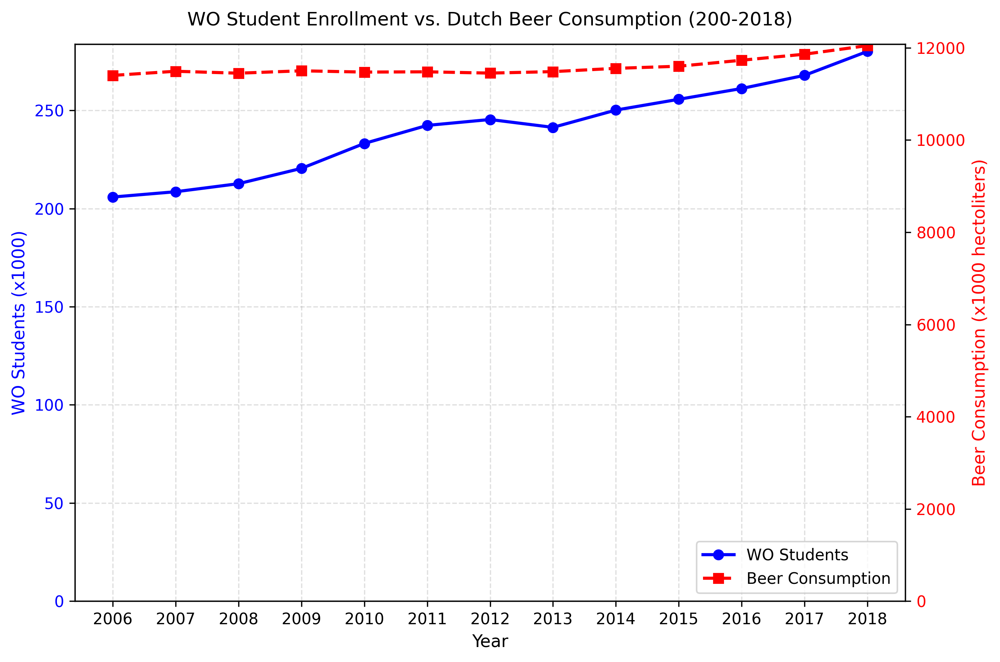

Student ID: 14724152

Van Dyke, M. C. C., Teixeira, M. M., & Barker, B. M. (2019). Fantastic yeasts and where to find them: the hidden diversity of dimorphic fungal pathogens. Current opinion in microbiology, 52, 55-63.

Harvey, J. T., Culvenor, J., Payne, W., Cowley, S., Lawrance, M., Stuart, D., & Williams, R. (2002). An analysis of the forces required to drag sheep over various surfaces. Applied ergonomics, 33(6), 523-531.

de Ziegler, D., Mattenberger, C., Luyet, C., Romoscanu, I., Irion, N. F., & Bianchi-Demicheli, F. (2005). Clinical use of aromatase inhibitors (AI) in premenopausal women. The Journal of steroid biochemistry and molecular biology, 95(1-5), 121-127.

There seems to be little correlation between the amount of WO students vs beer consumption, as the amount of WO keeps growing, but the beer consumption is rather constant.

